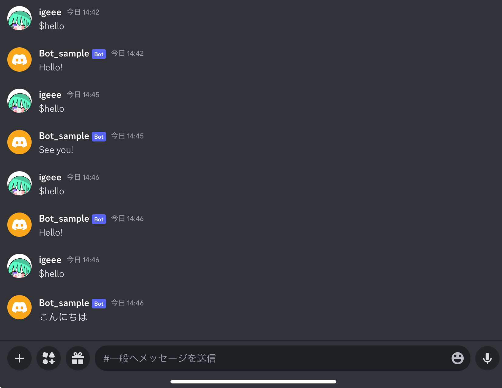
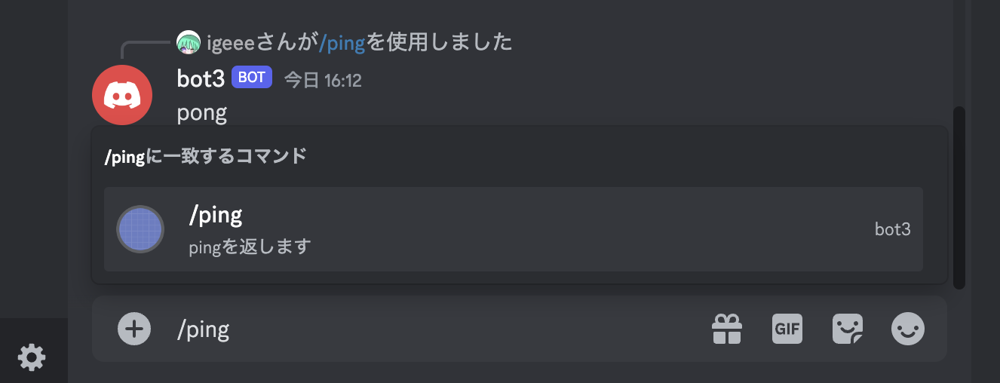
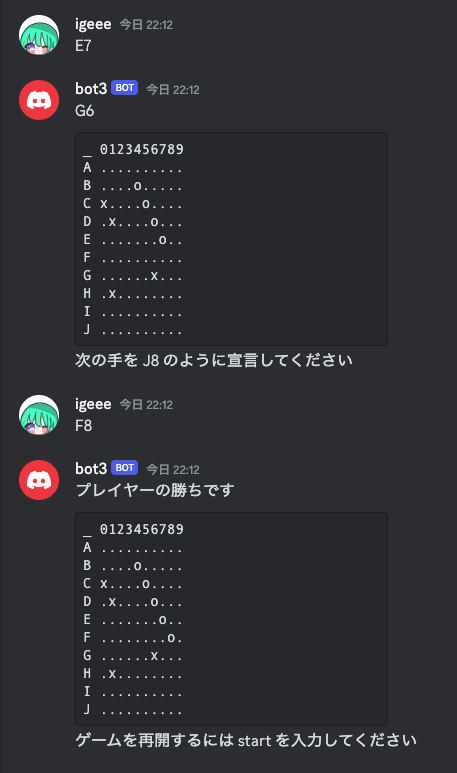

# DiscordBotを作る(上級編)
## 上級編の内容
* ローカル環境(自分のPC上でDiscordBotの開発をする)
* DiscordBotを常時オンラインにできるようにするためには
* DiscordBotの機能を増やす

## ローカル環境(自分のPC上でDiscordBotの開発をする)

ローカル環境で開発を行うにはPythonを実行する環境を整える必要があります.ここではvenvという仮想環境を用意してその中で実行する環境を整えます。手元でPythonが動く環境がない方は今日はRepl.itを使うことをおすすめします。<br>
mac,linuxの人は
```
python3 --version
```
とコンソールで打ってpythonのバージョン表示が出るか確認しましょう.pythonのバージョンが表示されればpythonを実行する環境があります.<br>
windowsの人は同じくコマンドプロンプトで
```
python –version
```
と打って確認してください .<br>
以下pythonの実行環境があることを前提としています.

### 作業用のディレクトリを作成し移動

```
mkdir DiscordBot
cd DiscordBot
```

### pythonの仮想環境を作成

Windowsの場合
```bash
python -m venv .venv
```

Linxu/Macの場合
```bash
python3 -m venv .venv
```

### 仮想環境をアクティベート

Windowsの場合
```bash
.venv\Scripts\activate
```
Linux/Macの場合
```
source .venv/bin/activate
```
コンソール上で(.venv)といった表記が出ればOKです。

### 必要なパッケージのインストール
```
pip install discord.py python-dotenv
```
適宜必要になったらほかも入れてください

### 環境変数の設定(中級編の6に対応する内容です)
ローカル環境ではRepl.itと同じようにTOKENを管理できないので.envというファイルにTOKEN情報を書き込みます。
Windowsの場合
```
type nul > .env
```
Linux/Macの場合
```
touch .env
```
として.envファイルを作成してください.ファイルマネージャーとかFinderとかから作っても問題ないです。　

envファイルを作成したら以下を記述してださい。

```
TOKEN='Discordアカウントの準備で作成したトークンをここに'
```

※envの内容はいわゆるCredentialsなので外に漏らさないように管理しましょう。

これで環境の構築は完了です。あとはこのディレクトリ内でpythonファイルを作成しコードを書いて実行して見ましょう
コードの実行は例えばmain.pyなら
Windowsの場合
```
python main.py
```
Mac/Linuxの場合
```
python3 main.py
```
で実行できます。

### 2回目以降
２回目以降は環境の構築は不要なので作業ディレクトリに移動して
Windowsの場合
```bash
.venv\Scripts\activate
```
Linux/Macの場合
```
source .venv/bin/activate
```
で仮想環境をアクティベートしてください。

### サンプルコード
中級編と同じことができるプログラムです

```python
# インストールした discord.py を読み込む
import discord
import os
from dotenv import load_dotenv

load_dotenv()
TOKEN = os.getenv("TOKEN")
# 接続に必要なオブジェクトを生成
client = discord.Client(intents=discord.Intents.all())

@client.event
async def on_ready():
    print('We have logged in as {0.user}'.format(client))

@client.event
async def on_message(message):
    if message.author == client.user:
        return

    if message.content.startswith('$hello'):
        await message.channel.send('Hello!')

# Botの起動とDiscordサーバーへの接続
client.run(TOKEN)
```

## DiscordBotを常時オンラインにするには
中級編でやったようにRepl.it上でプログラムを実行するとBotをオンラインにしてチャットのやり取りなどができるようになります。
しかし、Repl.itを閉じたり、実行から１時間程度経つとオフラインになってしまいます。
### デプロイをする
DiscordBotを常時オンラインにするためには「デプロイ」をする必要があります。デプロイとは簡単に言うと実行ファイルをWebサーバー上に配置して、常に利用できる状態にすることです。Webサーバー利用するため多くの場合デプロイをしてサービスを稼働しつづけるためにはお金がかかるのですが、中には条件付きで無料でデプロイができるサービスもあります。
詳しくは下の記事を見たり、調べたりしてください
[クラウドサービスRenderを利用したPythonアプリの無料デプロイ方法](https://qiita.com/kakiuchis/items/0225664568ece7b7b08b)

## DiscordBotの機能を増やす
使えそうな記事の共有やサンプルプログラムの共有をします。サンプルプログラムを動かす際は追加のパッケージのインストールが必要な場合があります。

<details><summary>ランダムな応答をするようにする</summary>

```python
import discord
import os
from dotenv import load_dotenv

import random

load_dotenv()
TOKEN = os.getenv("TOKEN")
# 接続に必要なオブジェクトを生成
client = discord.Client(intents=discord.Intents.all())

@client.event
async def on_ready():
    print('We have logged in as {0.user}'.format(client))

@client.event
async def on_message(message):
    if message.author == client.user:
        return

    wordslist = ['Hello!','See you!','こんにちは','さようなら']

    if message.content.startswith('$hello'):
        await message.channel.send(wordslist[random.randint(0,len(wordslist)-1)])

# Botの起動とDiscordサーバーへの接続
client.run(TOKEN)
```


</details>

<details><summary>スラッシュコマンドの実装</summary>

```python
import discord
import os
from dotenv import load_dotenv

from discord import app_commands

load_dotenv()
TOKEN = os.getenv("TOKEN")
# 接続に必要なオブジェクトを生成
client = discord.Client(intents=discord.Intents.all())
tree = app_commands.CommandTree(client)

# 接続の確認
@client.event
async def on_ready():
    print('We have logged in as {0.user}'.format(client))

@tree.command(name="ping", description="pingを返します。")
async def ping_command(interaction: discord.Interaction):
    await interaction.response.send_message("pong", ephemeral=False)

# Botの起動とDiscordサーバーへの接続
client.run(TOKEN)
```

Discordのチャンネルの方で少し設定が必要になります。下のリンクを見てください<br>
https://note.com/trpg_lisa/n/nca62b0ab145c#cc3075f0-df0b-4d0b-8f83-1c1dffc849b3
<br>(サーバー設定->連携サービス->自分のbot->コマンドの部分の上書き設定を全部チェックつければいけます)
</details>

<details><summary>対話型ゲーム(五目並べ)</summary>

このプログラムを実行するにはチャンネルIDを.envファイルに記入する必要があります。<br>
やりかたは、Discordのユーザー設定->詳細設定から開発者モードをオンにして、
BotがいるDiscordのテキストチャンネルの名前を右クリックしてチャンネルのIDをコピーします。
.envファイルに
```
CHANNEL_ID = 'チャンネルID(数字19桁)'
```
とTOKENと同じように記入してください。

Botは置ける内でランダムな場所を選択するようになっています。Botが強くなるようにGameクラスの
BotMove()メソッドを改良してみてください。

```python

import discord
import os
from dotenv import load_dotenv

import random

load_dotenv()
TOKEN = os.getenv("TOKEN")
CHANNEL_ID = os.getenv("CHANNEL_ID")
# 接続に必要なオブジェクトを生成
client = discord.Client(intents=discord.Intents.all())

keyword = 'start' #ゲーム開始の宣言キーワード


async def send_message(message, channel_id=CHANNEL_ID):
    """指定したチャンネルIDにメッセージを送信する関数"""
    channel = client.get_channel(int(channel_id))
    if channel:
        await channel.send(message)
    else:
        print(f"Channel with ID {channel_id} not found.")

@client.event
async def on_ready():
    print('We have logged in as {0.user}'.format(client))
    await send_message('ゲームを開始するには ' + keyword + ' を入力してください')

#========================================Class定義始め

class Game :
    def __init__(self) -> None:
        '''
        五目並べゲームの初期化(盤面の初期化)botは後手固定
        盤面は10 * 10の配列で管理
        使われていない -> '.'
        プレイヤーが選択済み -> 'o'
        ボットが選択済み -> 'x'
        '''
        self.boad = [['.' for i in range(10)] for j in range(10)]

    def showBoadStatus(self)->str:
        '''
        盤面の情報を出力するための文字列を作成
        _ 0123456789
        A ..........
        B ..........
        C ..........
        D ..........
        E ..........
        F ..........
        G ..........
        H ..........
        I ..........
        J ..........
        みたいな文字列を返す
        '''
        ret = '```'
        ret += '\n_ 0123456789'
        for i in range(10):
            ret += '\n'
            ret += chr(ord('A') + i) + ' '
            for j in range(10):  
                ret += self.boad[i][j]
            
        ret += '```'
        return ret
    
    def showError(self,message,is_valid)->str:
        '''
        プレイヤーに次の手の宣言(message)が不正であることをフィードバックし、
        次の選択を再び聞く文字列を返す
        is_valid = -1 : フォーマットミス, is_valid = -2 :すでに置かれている  
        '''
        if is_valid == -1:
            return str(message)  + ' は正しい入力形式ではありません\n A3 や G6 のように英語大文字と数字の2文字で宣言してください'
        else :
            return str(message) + ' はすでに使われているため選択できません\n他の手を宣言してください'
            

    def ij_To_str(self,i,j)->str:
        '''
        盤面の上からi番目、左からj番目の選択を
        出力用のフォーマット(A3とかB0とか)に変換
        '''
        return chr(ord('A') + i) +chr(ord('0') + j) 

    def askNextMove(self)->str:
        '''
        プレイヤーに次の手を尋ねる文字列を返す
        おける場所をランダムに示す
        '''
        pi = []
        pj = []

        for i in range(10):
            for j in range(10):
                if self.boad[i][j] == '.':
                    #おける
                    pi.append(i)
                    pj.append(j)

        id = random.randint(0,len(pi)-1) #両閉区間[0,len(pi)-1]から整数をランダムに選択
        ret = self.ij_To_str(pi[id],pj[id]) #返却文字列の作成

        return '次の手を ' + ret +  ' のように宣言してください'
    
    def isValidMove(self,message)->int:
        '''
        messageが合法な次の手か確認する
        合法->boadの情報を更新して1を返す
        フォーマットミス->-1を返す
        すでに使われている->-2を返す
        '''
        
        msg = str(message)
        if(len(msg) != 2):#長さ違う
            return -1
        if not ('A' <= msg[0] <= 'J' and '0' <= msg[1] <= '9'): #取りうる文字の条件を満たしていない
            return -1
        
        i = ord(msg[0]) - ord('A')
        j = ord(msg[1]) - ord('0')
        if self.boad[i][j] == '.':
            #合法
            self.boad[i][j] = 'o' #更新
            return 1
        else :
            #使われていた
            return -2
    
    def isFinish(self)->int:
        '''
        ゲームが終わったか判定
        継続: 0を返す
        Botの勝ち: 1を返す
        プレイヤーの勝ち: 2を返す
        引き分け(全盤面を使い切った):-1を返す
        '''
        #全探索
        #引き分け判定
        is_draw = True
        for i in range(10):
            for j in range(10):
                if(self.boad[i][j] == '.'):
                    is_draw = False
        
        if(is_draw):#引き分け
            return -1

        for i in range(10):
            for j in range(10):
                if(self.boad[i][j] == '.'): continue
                base = self.boad[i][j]
                #横
                if(j + 5 <=10):
                    able = True
                    for k in range(5):
                        if(self.boad[i][j+k] != base):
                            able = False
                            break
                    if(able):
                        return 1 if base == 'x' else 2
                    
                #縦
                if(i + 5 <= 10):
                    able = True
                    for k in range(5):
                        if(self.boad[i+k][j] != base):
                            able = False
                            break
                    if(able):
                        return 1 if base == 'x' else 2
                
                #右下
                if(i + 5 <= 10 and j + 5 <= 10):
                    able = True
                    for k in range(5):
                        if(self.boad[i+k][j+k] != base):
                            able = False
                            break
                    if(able):
                        return 1 if base == 'x' else 2
                
                #左下
                if(i + 5 <= 10 and j - 5>= 0):
                    able = True
                    for k in range(5):
                        if(self.boad[i+k][j-k] != base):
                            able = False
                            break
                    if(able):
                        return 1 if base == 'x' else 2
                    
        return 0
    
    def showResult(self,fin)->str:
        '''
        ゲーム終了した際に結果の文字列を返す
        '''
        if fin == 1:
            return 'Botの勝ちです'
        elif fin == 2:
            return 'プレイヤーの勝ちです'
        else :
            return '引き分けです'
        
    def BotMove(self)->str:
        '''
        Botの次の選択を文字列で返す
        Botの選択はおけるところにランダムに置く

        Botの改良をしてみてください
        '''
        pi = []
        pj = []

        for i in range(10):
            for j in range(10):
                if self.boad[i][j] == '.':
                    #おける
                    pi.append(i)
                    pj.append(j)

        id = random.randint(0,len(pi)-1) #両閉区間[0,len(pi)-1]から整数をランダムに選択
        self.boad[pi[id]][pj[id]] = 'x' #(pi[id], pj[id])に置く
        ret = self.ij_To_str(pi[id],pj[id])  #返却文字列の作成
        return ret
    
#=============Class定義終わり

is_gameStarted = False #ゲームが始まっているかを判定

game = Game() #ゲームのオブジェクト


@client.event
async def on_message(message):
    if message.author == client.user:
        return
    
    global is_gameStarted,game

    if is_gameStarted == True:
        is_valid = game.isValidMove(message.content) #プレイヤーの選択が合法か(1:OK,-1:フォーマットミス,-2:すでに置かれている)
        print(is_valid)
        if is_valid == 1:
            #終了判定
            fin =game.isFinish() #終わったかの判定を入れる
            if(fin != 0):
                #終わらせる
                await send_message(game.showResult(fin))
                await send_message(game.showBoadStatus())
                await send_message('ゲームを再開するには ' + keyword + ' を入力してください')
                is_gameStarted = False
                return
            #次の１手を選択
            await send_message(game.BotMove())

            #終了判定
            fin =game.isFinish() #終わったかの判定を入れる
            if(fin != 0):
                #終わらせる
                await send_message(game.showResult(fin))
                await send_message(game.showBoadStatus())
                await send_message('ゲームを再開するには ' + keyword + ' を入力してください')
                is_gameStarted = False
                return
            
        else :
            #エラーを返す
            await send_message(game.showError(message.content,is_valid))
            

        #盤面情報を表示して相手を待つメッセージを送る
        await send_message(game.showBoadStatus())
        await send_message(game.askNextMove())
        
            
    else:
        #ゲーム開始のコマンドが来たら反応する
        if message.content.startswith(keyword):
            await send_message('Game Start!')
            game = Game()
            is_gameStarted = True
            await send_message(game.showBoadStatus())
            await send_message(game.askNextMove())

# Botの起動とDiscordサーバーへの接続
client.run(TOKEN)
```

</details>

<!-- <details><summary>追加</summary>

</details> -->


[triC_Bot](https://github.com/triC-tmu/tric-bot)
triCのDiscordBotです。Ayuくんが主に作っています。ネット上の情報を拾ってくるとかの参考になるかと思います。

[Pythonで実用Discord Bot(discordpy解説)](https://qiita.com/1ntegrale9/items/9d570ef8175cf178468f)

[Discord Botを作ってみよう #02 - スラッシュコマンドを使ってみよう](https://qiita.com/ukwhatn/items/48953e30ed67dee6fe38)

[誰でも作れる！Discord Bot（応用編）](https://note.com/exteoi/n/n87bd4fa02c95)

[discord.py を使用したdiscord botの作り方を基本から応用まで](https://qiita.com/TakeMimi/items/1e2d76eecc25e92c93ef)
