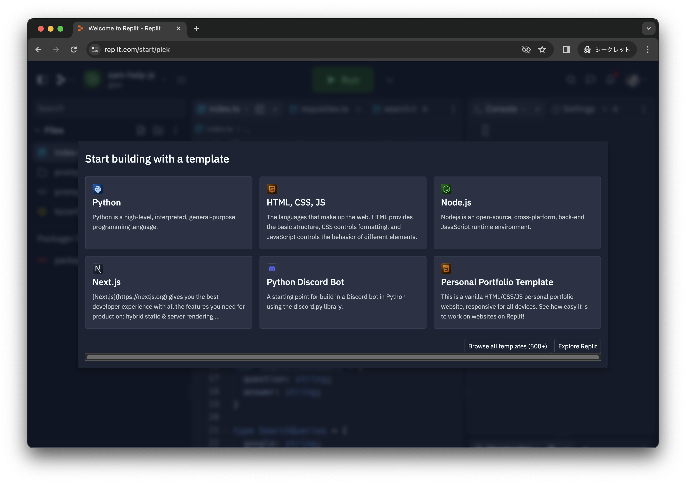
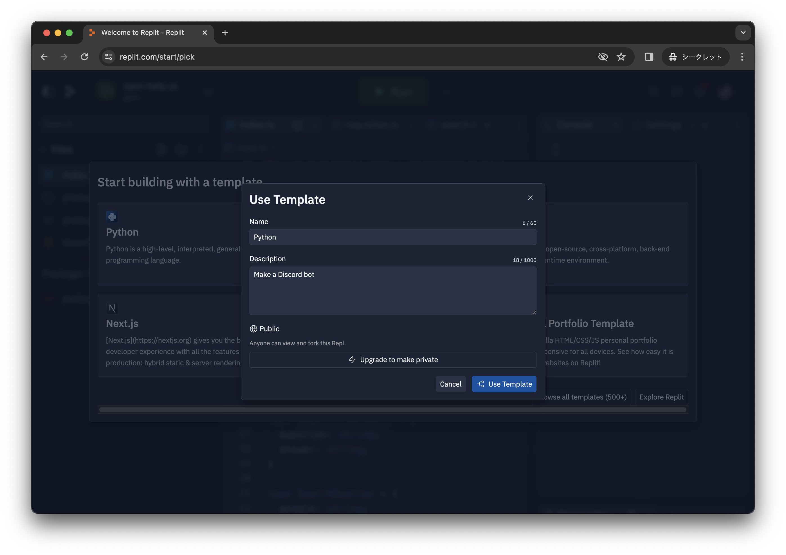
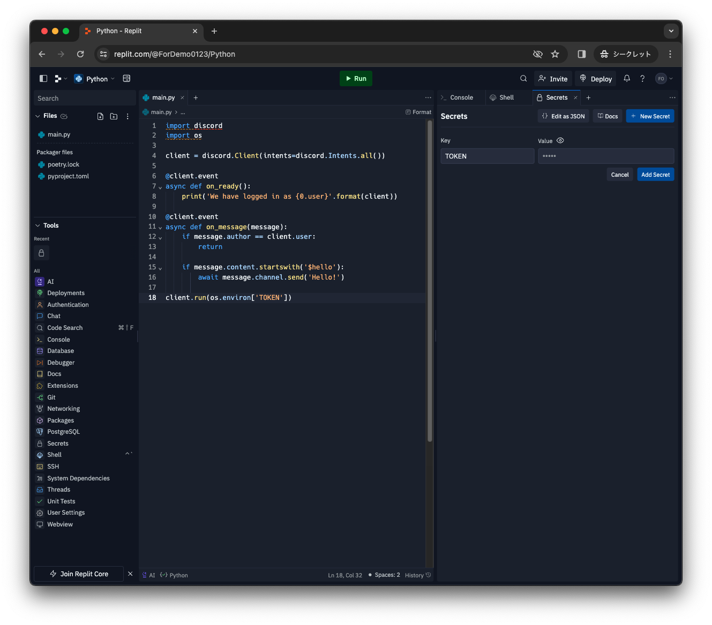

# DiscordBotを作る(中級編)
## 中級編の目標
1. Repl.itを使ってDiscordBotを立ち上げて特定のメッセージに対して返信をするBotを作る
<!-- 2. 固定メッセージを返す機能と簡単なスラッシュコマンドの実装 -->
  
[参考リンク](https://www.freecodecamp.org/japanese/news/create-a-discord-bot-with-python/)

## Repl.itを使ってBotを起動させよう
今回はRepl.itというサイトでPythonを使ってBotを動かすためのプログラムを作成、実行させます。
#### Repl.itとは
Repl.itはウェブブラウザー内で使用できるオンライン IDE(コードを書いて実行することができる環境) です。Repl.itを使うことで自分のパソコンでPythonを実行できる環境がなくてもPythonのプログラムを書いて実行することができます。<br>
自分のパソコンにPythonを入れてやりたい人は上級編を見てください！

## Repl.itでBotを起動させる
1. [Repl.it](https://replit.com/)にサインアップしてログインします。
1. 使用用途と経験が問われるので下のように選択します。(経験はご自由に)

1. Pythonを選択します。

1. アプリの説明を書きます。(適当で大丈夫です。)

1. エディター画面が開いたら下のプログラムをコピー&ペーストします
```python
import discord
import os

client = discord.Client(intents=discord.Intents.all())

@client.event
async def on_ready():
    print('We have logged in as {0.user}'.format(client))

@client.event
async def on_message(message):
    if message.author == client.user:
        return

    if message.content.startswith('$hello'):
        await message.channel.send('Hello!')

client.run(os.environ['TOKEN'])
```

貼付け後の画像↓


6. TOKEN情報の保存
* [Discord Developer Portal](https://discord.com/developers/applications)の自分のアプリを選択し、settingタブのBotからトークンをコピーします。Reset Tokenというボタンが出る人はそれを押してTokenを再作成してください.


* [Repl.it](https://replit.com/)に戻りToolsからSecretsを選択し、出てきた右画面のNew SecretボタンからKeyに TOKEN と入力し、Valueにコピーしたトークンを貼り付けます。


7. 動作確認
  ここまでできたらRunボタンからプログラムを実行してみましょう。うまく行っていればBotがオンラインになると思います。またこのプログラムは $hello とチャットするとHello!と返してくれるプログラムになっています。実際に試してみましょう。止めるときはStopのボタンから止めることができます。


8. 反応するメッセージと、返すメッセージを変更しよう
先程のプログラムのこの２行が反応するメッセージと返すメッセージになっています。シングルクォーテーション(\')で囲まれた文字列を変更して再度実行しチャットをして試してみましょう。
```
    if message.content.startswith('$hello'):
        await message.channel.send('Hello!')
```