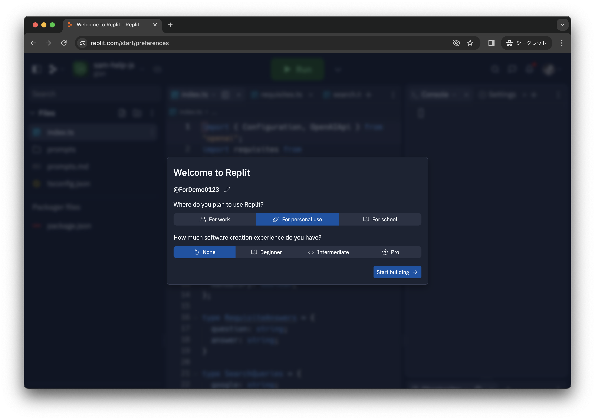
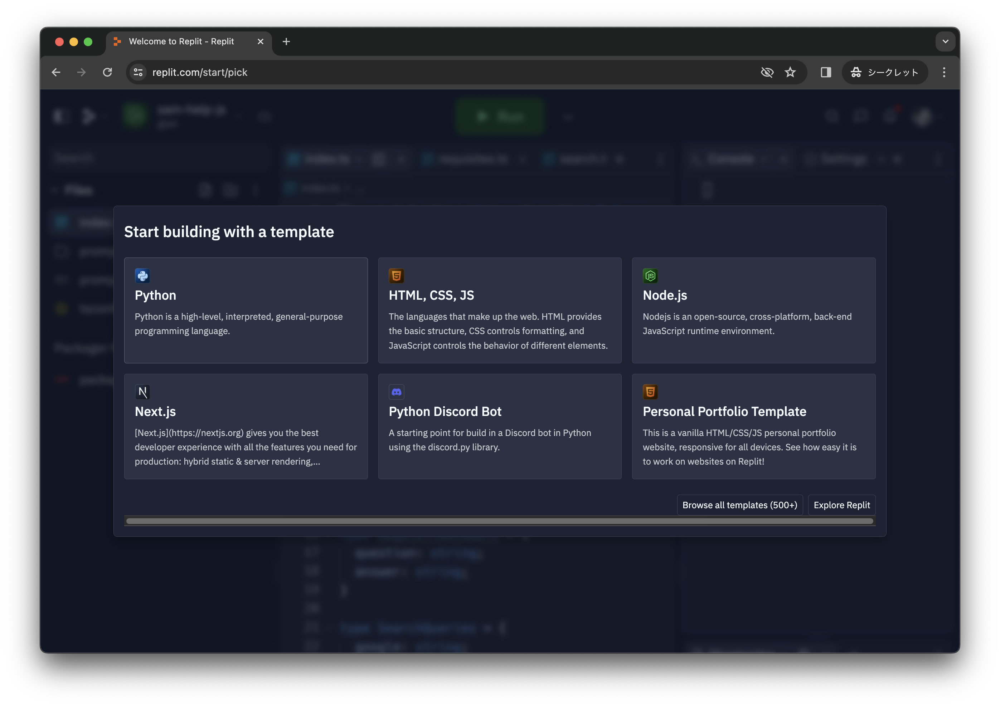
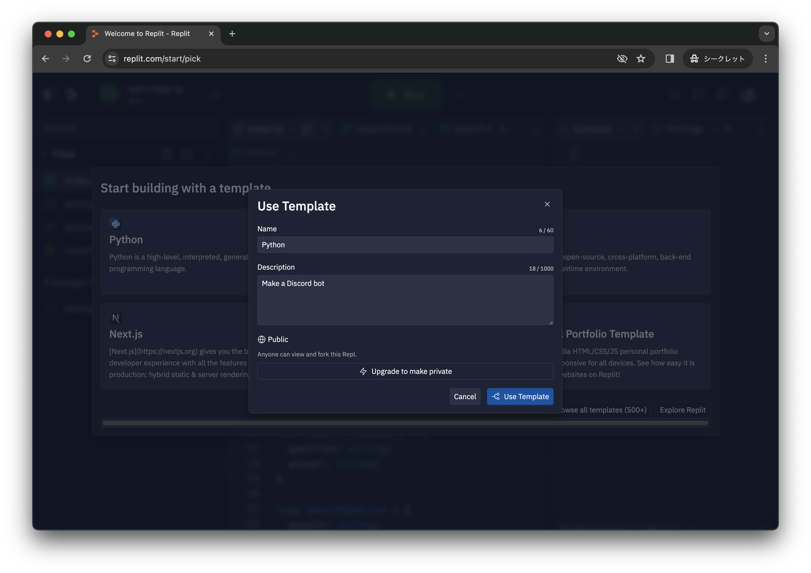
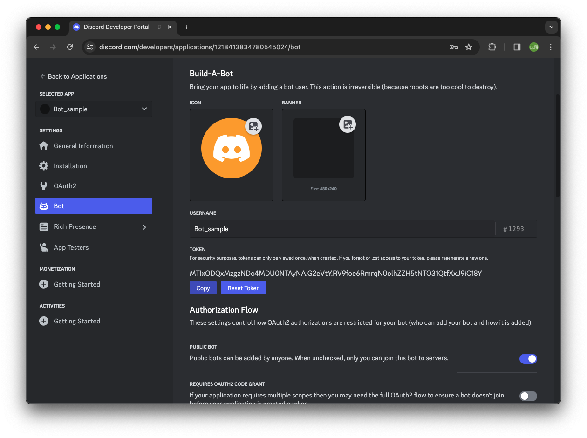
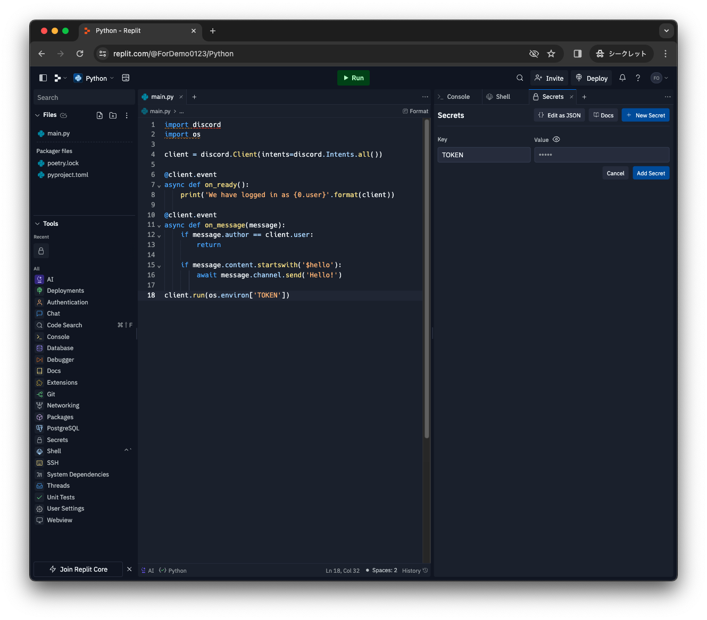
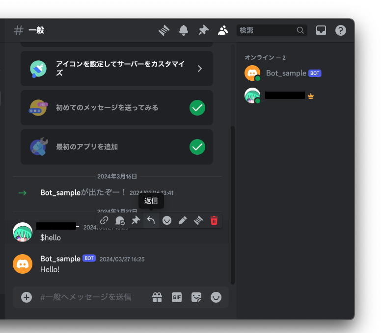

# Creating a Discord Bot (Intermediate Level)
## Objectives of the Intermediate Level
1. Create a bot using Repl.it to respond to specific messages.
<!-- 2. Implement functionality to return fixed messages and simple slash commands -->
  
[Reference Link](https://www.freecodecamp.org/japanese/news/create-a-discord-bot-with-python/)

## Launching the Bot with Repl.it
This time, we will create and run a program using Python on Repl.it to operate the bot.
#### What is Repl.it
Repl.it is an online IDE (Integrated Development Environment) that can be used within a web browser to write and execute code. With Repl.it, you can write and execute Python programs even if you don't have a Python environment on your computer.

## Starting the Bot with Repl.it
1. Sign up and log in to [Repl.it](https://replit.com/).
2. Choose the options for purpose and experience as shown below (Experience level is up to you).

3. Select Python.

4. Write a description for the app (anything appropriate).

5. Once the editor opens, copy and paste the following program:
```python
import discord
import os

client = discord.Client(intents=discord.Intents.all())

@client.event
async def on_ready():
    print('We have logged in as {0.user}'.format(client))

@client.event
async def on_message(message):
    if message.author == client.user:
        return

    if message.content.startswith('$hello'):
        await message.channel.send('Hello!')

client.run(os.environ['TOKEN'])
```

6. Saving the TOKEN information
   * Select your app in the [Discord Developer Portal](https://discord.com/developers/applications), go to the Bot tab under the settings, and copy the token. If you see the "Reset Token" button, click it to regenerate the token.
   

   * Return to [Repl.it](https://replit.com/), choose "Secrets" from the Tools menu, click "New Secret" on the right side, enter TOKEN as the Key, and paste the copied token as the Value.
   

   Those working in their local environment can achieve the same by creating a .env file and writing the token there. ([Reference](https://pypi.org/project/python-dotenv/))

7. Testing
   Once you've completed the above steps, click the Run button to execute the program. If everything goes well, your bot should come online. Additionally, this program responds with "Hello!" when you chat with it using "$hello". Give it a try. You can stop it by clicking the Stop button.
   

8. Changing the message to react and the message to return
   The two lines of the program from earlier determine which message triggers a response and what message to send back. Change the strings enclosed in single quotes (') and rerun the program to try chatting again.

```
    if message.content.startswith('$hello'):
        await message.channel.send('Hello!')
```
