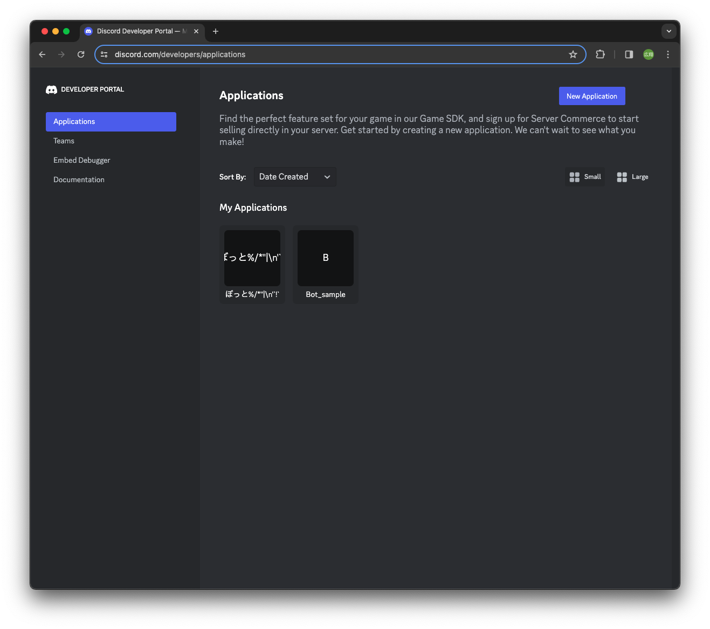
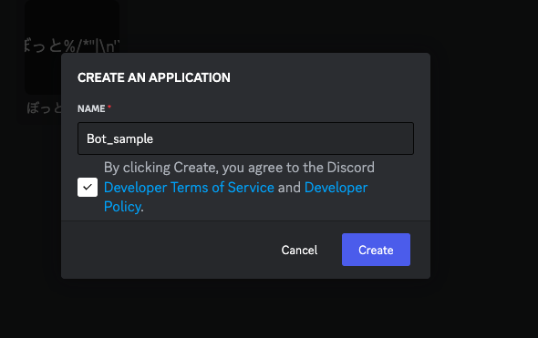
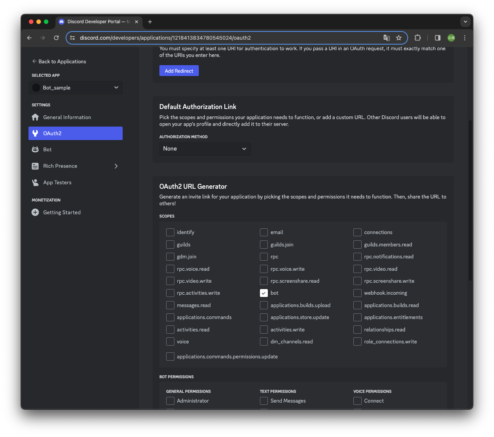
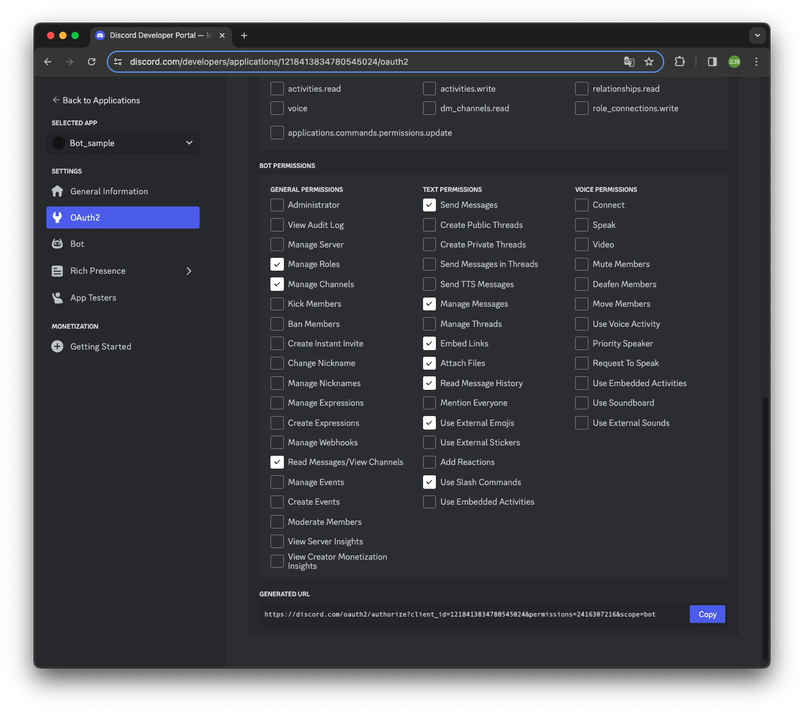
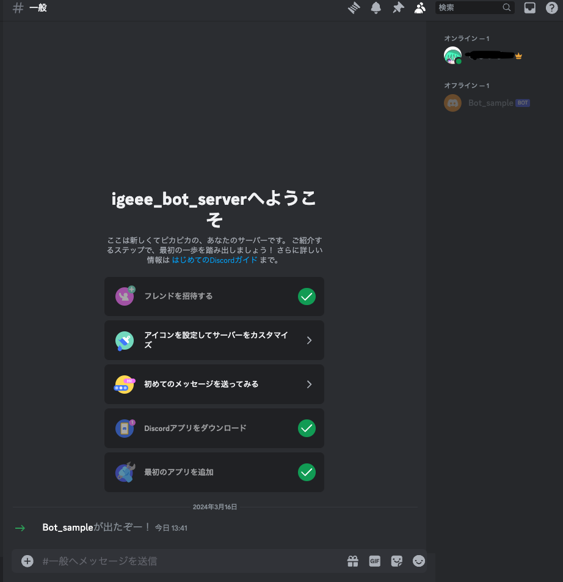

# DiscordBotを作る(初級編)
## 初級編の目標
1. DiscordのBotアカウントを作成する
1. サーバーにDiscordBotを招待する

[参考リンク](https://discordpy.readthedocs.io/ja/latest/discord.html)

## DiscordBotのアカウント作成
1. [Discordのウェブサイト](https://discord.com/) にログインできていることを確認する 
(Discordを開くを押してDiscordのチャット画面が開けばOK、電話認証、メール認証をしていなかったら指示に従ってやる)

1. [Applicationページ](https://discord.com/developers/applications) に移動  
(アカウントの認証が必要ですみたいな文言が出てきたらログインができていないので1に戻る)<bt>

1. New Application ボタンを押してアプリケーション名を記入してCreateボタンを押す 
(日本語や記号もOK) 

1. [Applicationページ](https://discord.com/developers/applications)で作成したBotを選択

1. SETTINGSのOAuth2タブを選択し、scopesのチェックボックスのbotにチェックを入れる 

1. Bot PermissionsからBotの機能に必要な権限にチェックを入れる 
(今回は下の画像のように入れてください) 

1. GENERATED URLのURLをコピーしてブラウザに貼り付け、Botを招待したいサーバーを選択し、「認証」をクリックするとサーバーに招待できます 
(Botを追加するサーバー管理権限が必要です)

招待できたら初級編は終了です。
