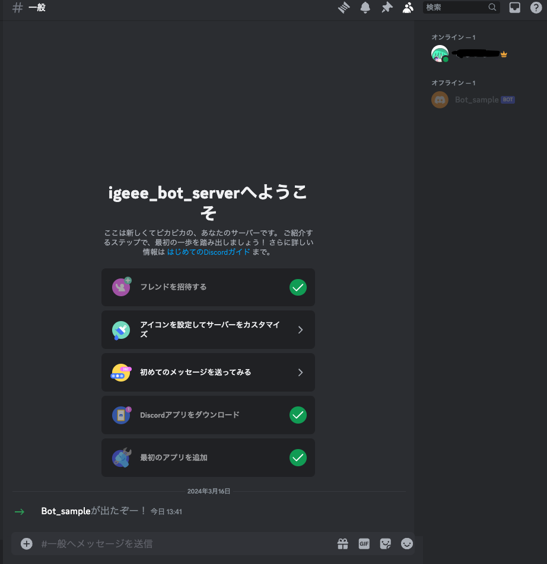

# Creating a Discord Bot (Beginner's Guide)
## Objectives of the Beginner's Guide
1. Create a Discord Bot account.
2. Invite the Discord Bot to a server.

[Reference Link](https://discordpy.readthedocs.io/en/latest/discord.html)

## Creating a Discord Bot Account
1. Make sure you are logged into the [Discord website](https://discord.com/).  
(If you can open Discord and see the chat interface, you're good to go. If not, follow instructions for phone or email verification.)

2. Navigate to the [Application page](https://discord.com/developers/applications).  
(If you see a message like "Account authentication required," you're not logged in. Go back to step 1.)

3. Click the New Application button, enter the application name, and click Create.  
(You can use Japanese or symbols for the name.)  

4. Select the bot you created on the Application page.

5. Enable all three Privileged Gateway Intents.  
 

6. Select the OAuth2 tab under SETTINGS, check the bot checkbox under scopes, and click Save Changes.  

7. Check the permissions required for the bot's functionality under Bot Permissions.  
(For this tutorial, check permissions as shown in the image below.)  

8. Copy the GENERATED URL and paste it into your browser. Select the server where you want to invite the bot and click "Authorize."  
(You need server management permissions to add the bot to a server.)  

Once you've successfully invited the bot, you've completed the beginner's guide.
