# Messaging APIを使ってチャットボットをつくる

## LINEプラットフォームからくるHTTPリクエストをGASで受け取る
1. LINE Official Accountを作成 (今回は初級編で利用したものを使用)

2. LINE Official Account ManagerのSettingsよりMessaging APIを有効にする
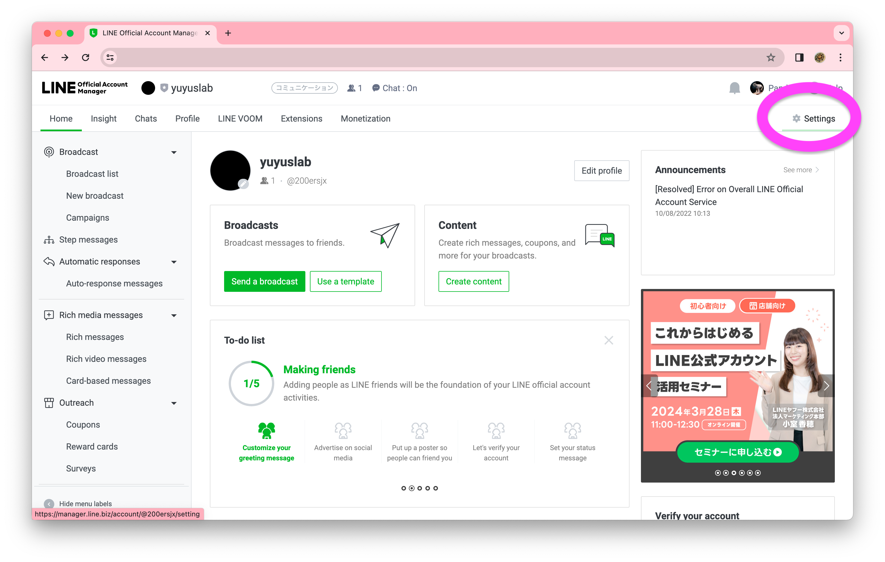
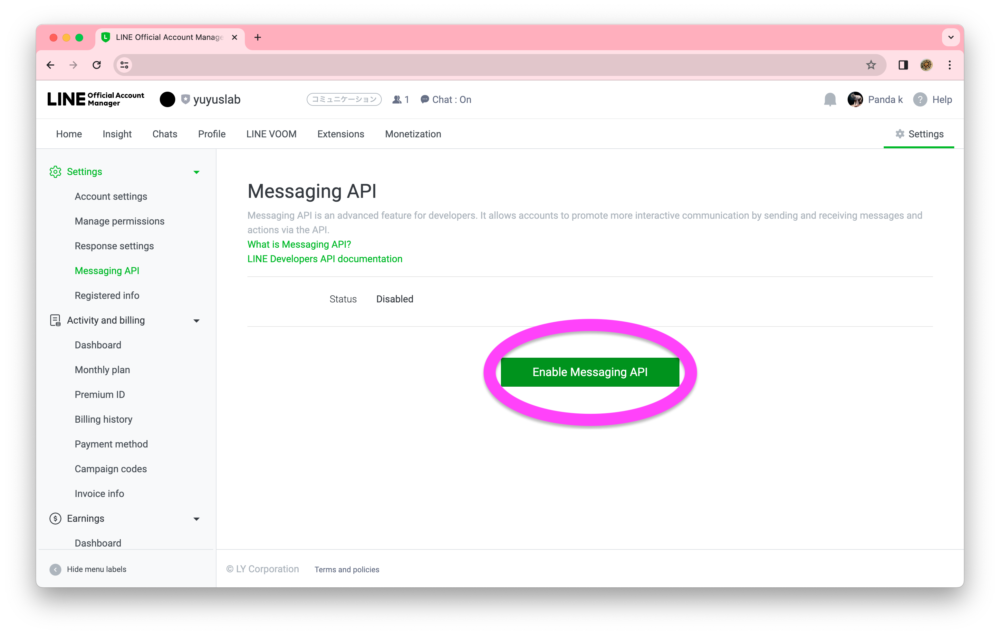

3. プロバイダーとのチャンネルをつくる (オプショナルは無視してOK)
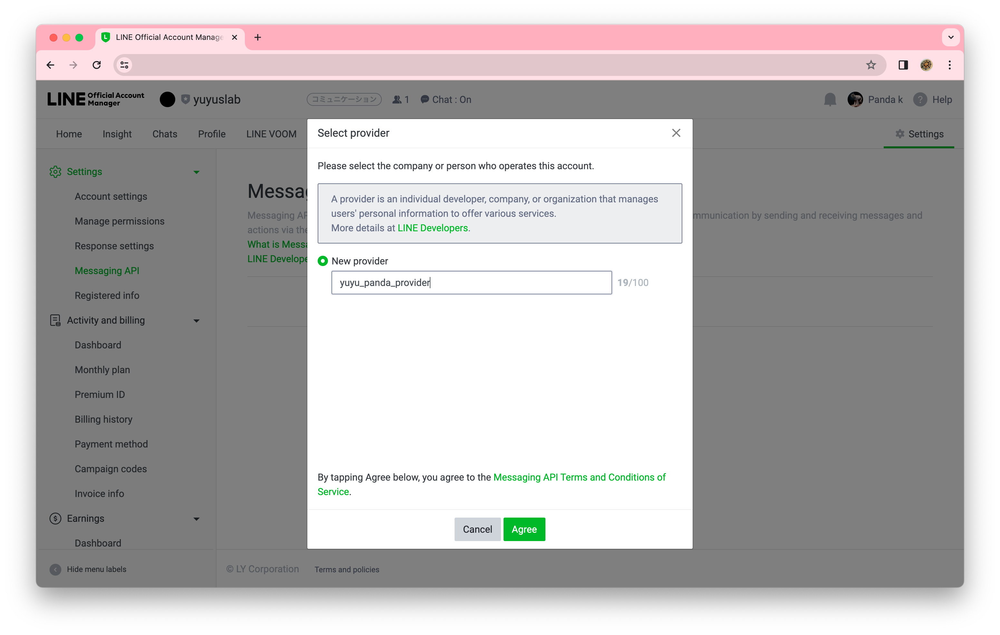
プロバイダー: LINEのプラットフォームを利用してサービスを提供しようとしている主体<br>
チャンネル: プロバイダーとLINEのプラットフォームをつなぐシステム<br>

こんなイメージ<br>
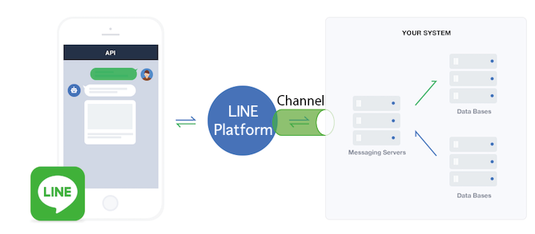

このような画面が出ればチャンネルができたということ
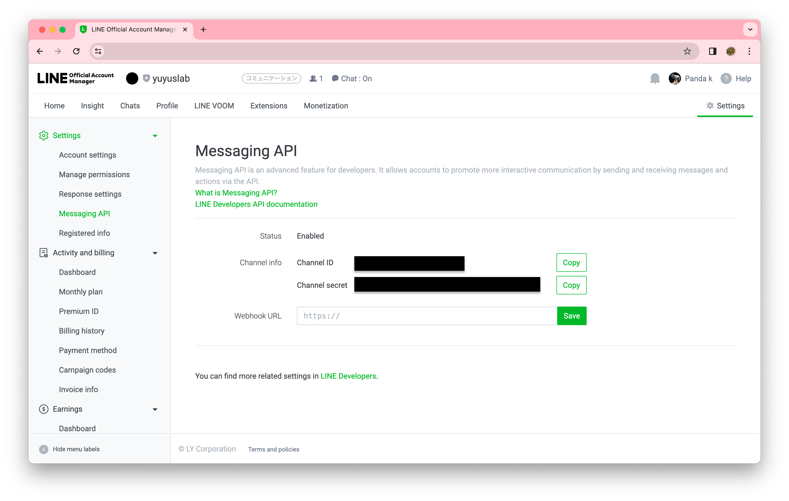

4. 新品Google スプレッドシートをつくり、Extentions > App Scriptを作成
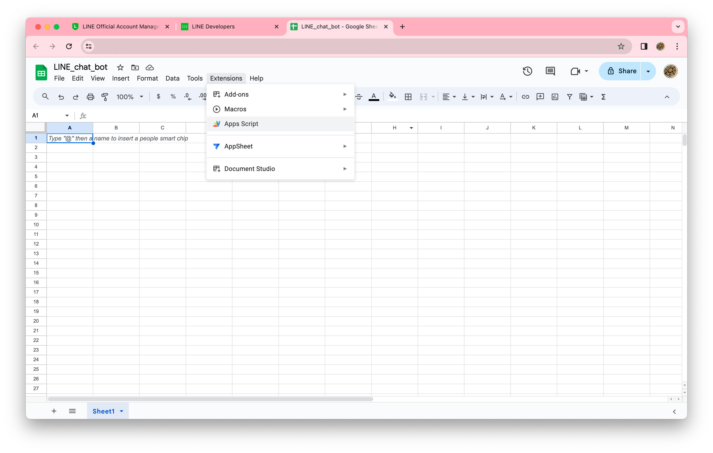

5. LINEのプラットフォームから来るHTTP POSTリクエストを受けとるGASコードをかく
```javascript
function doPost(e){
   let sheet = SpreadsheetApp.getActive().getActiveSheet();
   sheet.appendRow([new Date(), e.postData.contents]); 
   // e.postData.contents に LINE からの json 形式データがある
}
```

6. GASのアプリをデプロイ
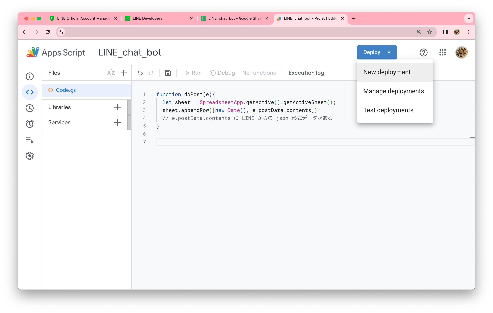

Webアプリを選択し、誰でもアクセスできるように設定
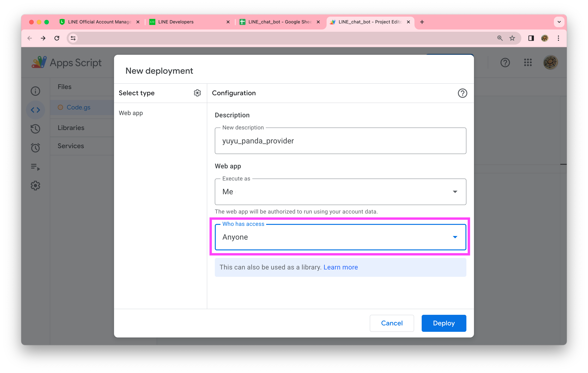

7. アクセスを承認 (警告が出てくるけど承認)
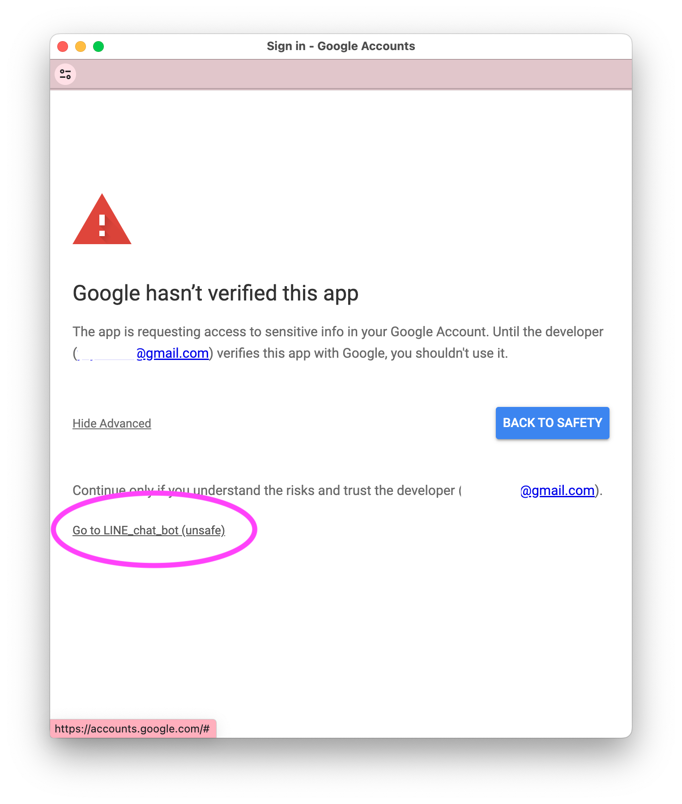

8. このWebアプリのURLがWebhookで使うやつだからコピー
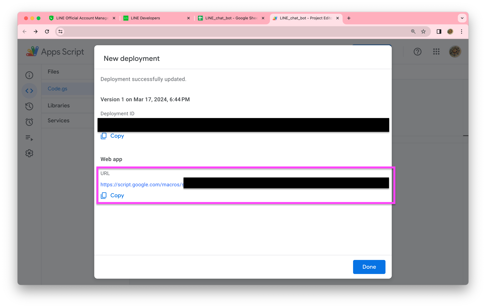

9. Official Account ManagerのSettings > Messaging APIにあるWebhook URLにペーストして保存
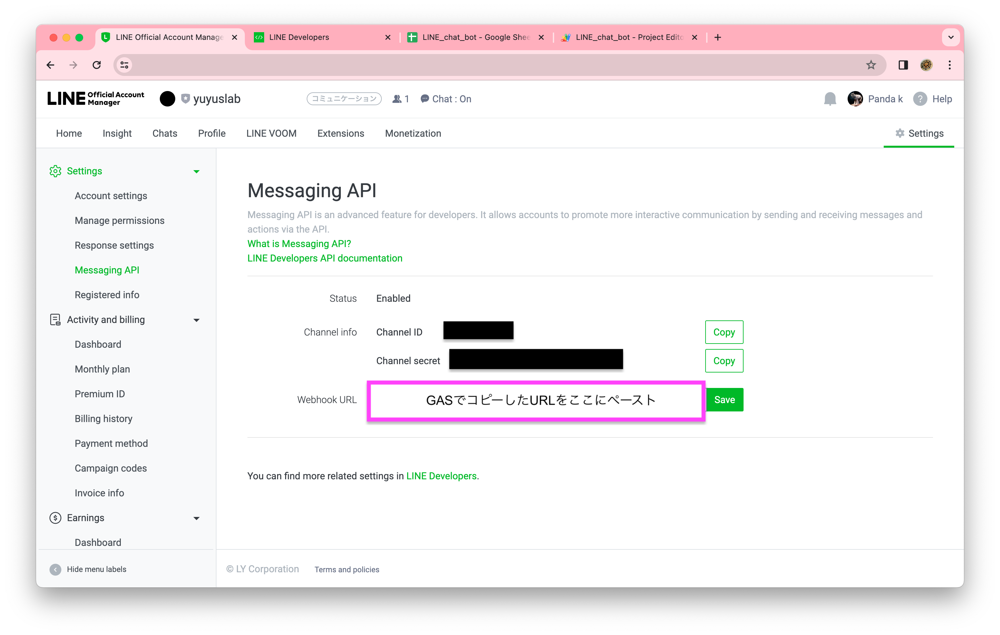

10. LINE Devlopersコンソール > プロバイダー > 該当するチャンネル > Messaging APIからQRコードをスマホのLINEでスキャンしてテキストを送ってみる or 検証ボタンを押す
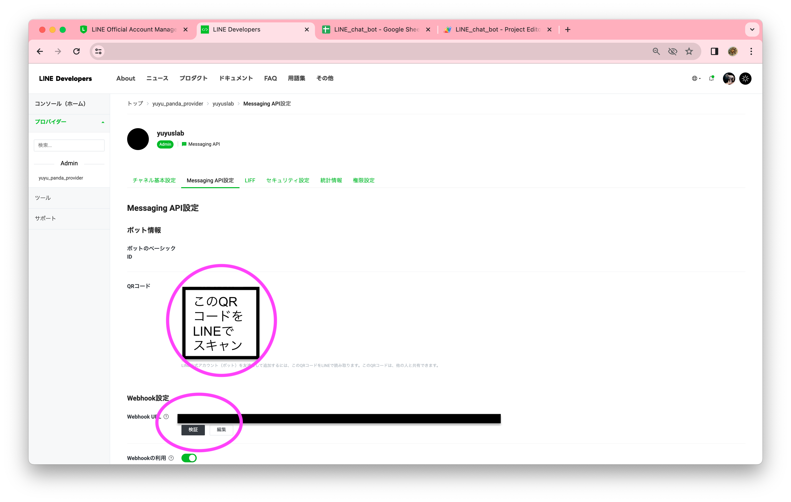

11. スプレッドシートにタイムスタンプと長いテキストが来てたら成功

今回はテキストが送られるというイベントでWebhookが作動しましたが、それ以外のイベントは[こちら](https://developers.line.biz/ja/docs/messaging-api/receiving-messages/#webhook-event-in-one-on-one-talk-or-group-chat)を見てみてください

12. HTTPリクエストで来た長いテキストを確認
JSONオブジェクトはこんな感じ (詳しくは[こちら](https://developers.line.biz/ja/reference/messaging-api/#webhook-event-objects))
```
{
   "destination":"U********************",
   "events":[
      {
         "type":"message",
         "message":{
            "type":"text",
            "id":"4**************",
            "quoteToken":"a***********************************************",
            "text":"ちゃんとGASに送れてるかなー"
         },
         "webhookEventId":"01*********************",
         "deliveryContext":{
            "isRedelivery":false
         },
         "timestamp":1710674716872,
         "source":{
            "type":"user",
            "userId":"U********************************"
         },
         "replyToken":"d*******************************",
         "mode":"active"
      }
   ]
}
```

## 受け取った文章で遊ぶ
`doPost()`に色々な機能をつけていきます。
今までのコードはもう使わなくてOKです (コメントアウトしちゃう)。

1. JSON stringをJavascriptのオブジェクトに変換
```javascript
function doPost(e) {
   let parsed = JSON.parse(e.postData.contents);
}
```

2. 後で使う情報を`parsed`から取り出す
```javascript
function getContents(data) {
   let events = data.events;
   for(let i = 0; i < events.length; i++) {
      let event = events[i];
      if(event.type == 'message'){
      if(event.message.type == 'text'){
         let texts = event.message.text;
         return {event, texts}
         }
      }
   }
}
```

`doPost()`を更新
```javascript
function doPost(e) {
   let parsed = JSON.parse(e.postData.contents);
   let contents = getContents(parsed); // 追加
   let conEvent = contents.event; // 追加
   let conTexts = contents.texts; // 追加
}
```

`conEvent`: あとでトークンを取り出すためのもの<br>
`conTexts`: 次のステップで遊んでLINEに送り返すテキスト

3. `conTexts`を反転する (別に他のことやってもいいよ〜)
```javascript
function reverseChars(s) {
   let ums = s;
   ms = ums.split('').reverse().join('');
   return ms
}
```

また`doPost()`を更新
```javascript
function doPost(e) {
   let parsed = JSON.parse(e.postData.contents);
   let contents = getContents(parsed);
   let conEvent = contents.event;
   let conTexts = contents.texts; 
   let replyMes = reverseChars(conTexts); // 追加
}
```

4. 返信する`messages`に`replyToken`をつける (`replyMesToken`はあとでHTTP POSTする時の`body`になる)
```javascript
function addReplyToken(event, repTexts) {
   let repToken = event.replyToken;
   let replyMesToken = {
   replyToken: repToken,
   messages: [{ type: 'text', text: repTexts }],
   };
   return replyMesToken
}
```

はい`doPost()`を更新
```javascript
function doPost(e) {
   let parsed = JSON.parse(e.postData.contents);
   let contents = getContents(parsed);
   let conEvent = contents.event;
   let conTexts = contents.texts; 
   let replyMes = reverseChars(conTexts);
   let repTokenAdded = addReplyToken(conEvent, replyMes); // 追加
}
```

4. LINEプラットフォームに送信する (詳しくは[こちら](https://developers.line.biz/ja/docs/messaging-api/sending-messages/#reply-messages))
```javascript
function reply(contents){
   let channelAccessToken = "下の画像で得るトークンをペースト";
   let replyUrl = "https://api.line.me/v2/bot/message/reply";
   let options = {
      method: 'post',
      contentType: 'application/json',
      headers: {
      Authorization: 'Bearer ' + channelAccessToken
      },
      payload: JSON.stringify(contents)
   };
   UrlFetchApp.fetch(replyUrl, options);
}
```

送信に必要なチャンネルアクセストークンを発行しコピーペースト (LINE Devlopersコンソール > プロバイダー > 該当するチャンネル > Messaging APIから一番下までスクロール)
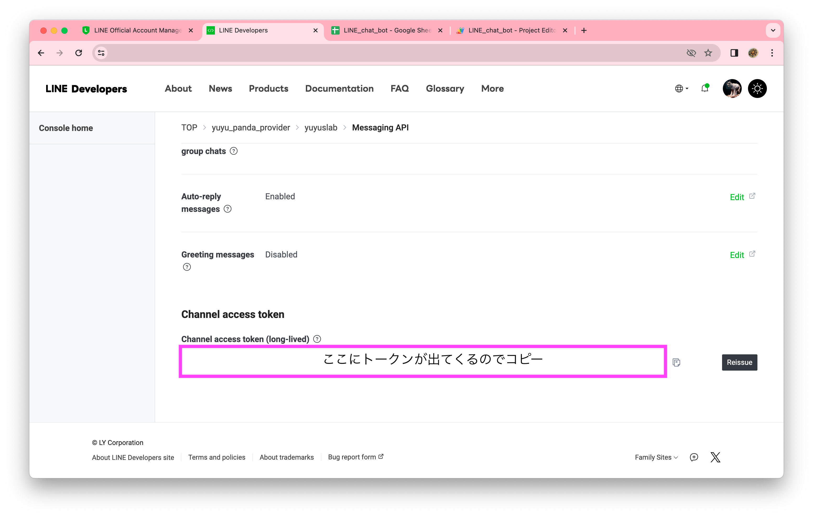

`doPost()`を更新〜
```javascript
function doPost(e) {
   let parsed = JSON.parse(e.postData.contents);
   let contents = getContents(parsed);
   let conEvent = contents.event;
   let conTexts = contents.texts; 
   let replyMes = reverseChars(conTexts);
   let repTokenAdded = addReplyToken(conEvent, replyMes);
   reply(repTokenAdded); // 追加
}
```

#### 最終的にGASはこうなる
```javascript
function doPost(e) {
   // let sheet = SpreadsheetApp.getActive().getActiveSheet();
   let parsed = JSON.parse(e.postData.contents);
   let contents = getContents(parsed);
   let conEvent = contents.event;
   let conTexts = contents.texts;
   let replyMes = reverseChars(conTexts);
   let repTokenAdded = addReplyToken(conEvent, replyMes);
   reply(repTokenAdded);
   // sheet.appendRow([new Date(),JSON.stringify(repTokenAdded)]); 
}

function getContents(data) {
   let events = data.events;
   for(let i = 0; i < events.length; i++) {
      let event = events[i];
      if(event.type == 'message'){
      if(event.message.type == 'text'){
         let texts = event.message.text;
         return {event, texts}
         }
      }
   }
}

function reverseChars(s) {
   let ums = s;
   ms = ums.split('').reverse().join('');
   return ms
}

function addReplyToken(event, repTexts) {
   let repToken = event.replyToken;
   let replyMesToken = {
   replyToken: repToken,
   messages: [{ type: 'text', text: repTexts }],
   };
   return replyMesToken
}

function reply(contents){
   let channelAccessToken = "チャンネルアクセストークン";
   let replyUrl = "https://api.line.me/v2/bot/message/reply";
   let options = {
      method: 'post',
      contentType: 'application/json',
      headers: {
      Authorization: 'Bearer ' + channelAccessToken
      },
      payload: JSON.stringify(contents)
   };
   UrlFetchApp.fetch(replyUrl, options);
}
```

## デプロイ
1. Manage deploymentsから鉛筆マークをクリック
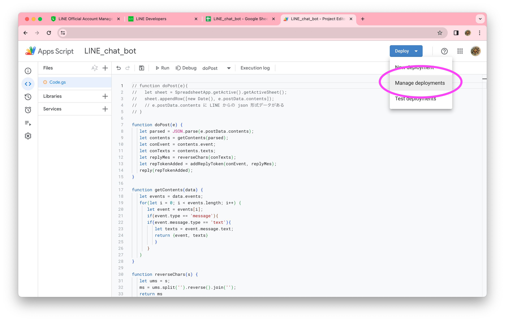

2. Versionは新しく、Descriptionはなんでも
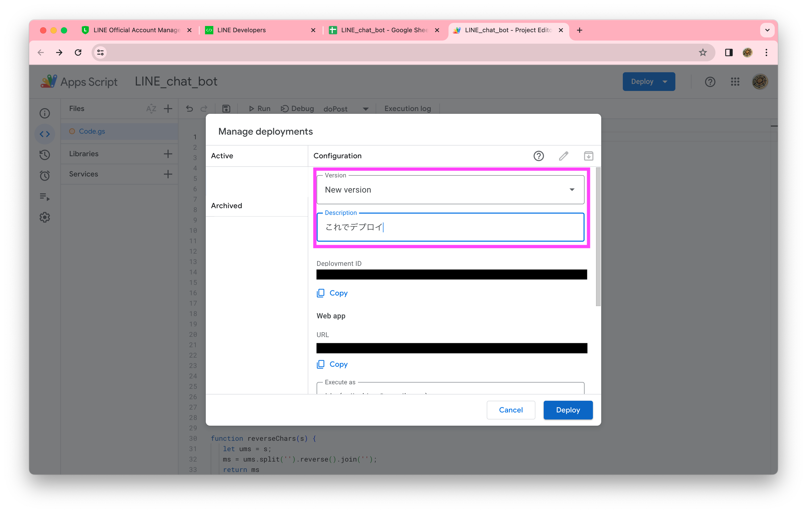

3. デプロイしたらWeb app URLをコピーしてOfficial Account ManagerのSettings > Messaging APIにあるWebhook URLにペーストして保存

GASアプリのURLはデプロイするごとに変わってしまうので新しくWebhookに登録する必要がある...がもしURLをそのままにできる方法があれば知りたいっす

4. LINEからメッセージを送ってみる<br>
どうでしたか？自分が送信したテキストが逆から書かれて返信されましたか？

終わり

#### 文中以外の参考資料
[神戸大学国際人間科学部の学部共通科目「プログラミング基礎演習１・２」より「Google Apps Script で LINE Bot を作成する」](https://www2.kobe-u.ac.jp/~tnishida/programming/GAS-03.html) <br>
[LINE Developersより「Messaging APIを始めよう」](https://developers.line.biz/ja/docs/messaging-api/getting-started/#step-one-log-in-to-line-developers-console)