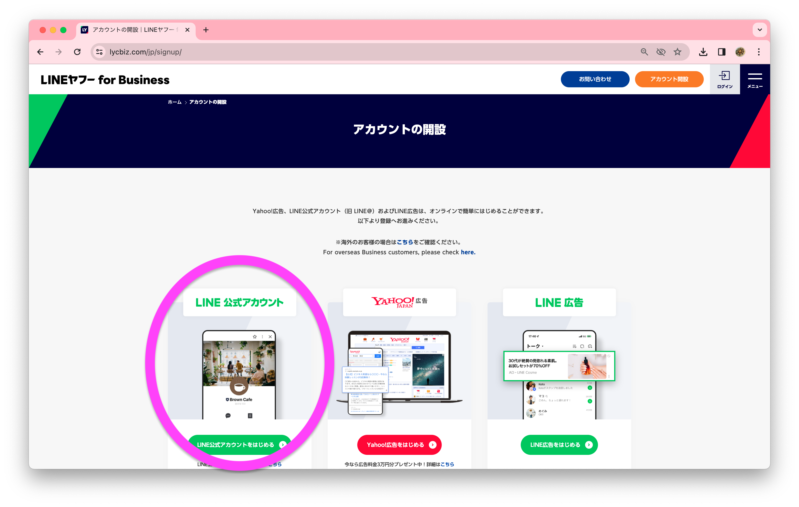
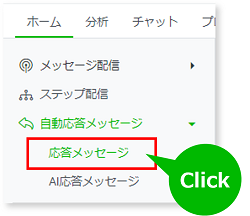
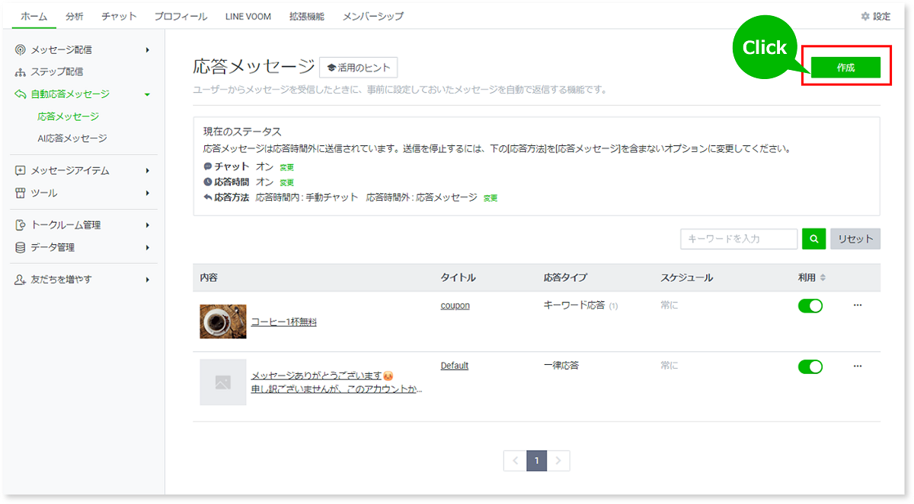
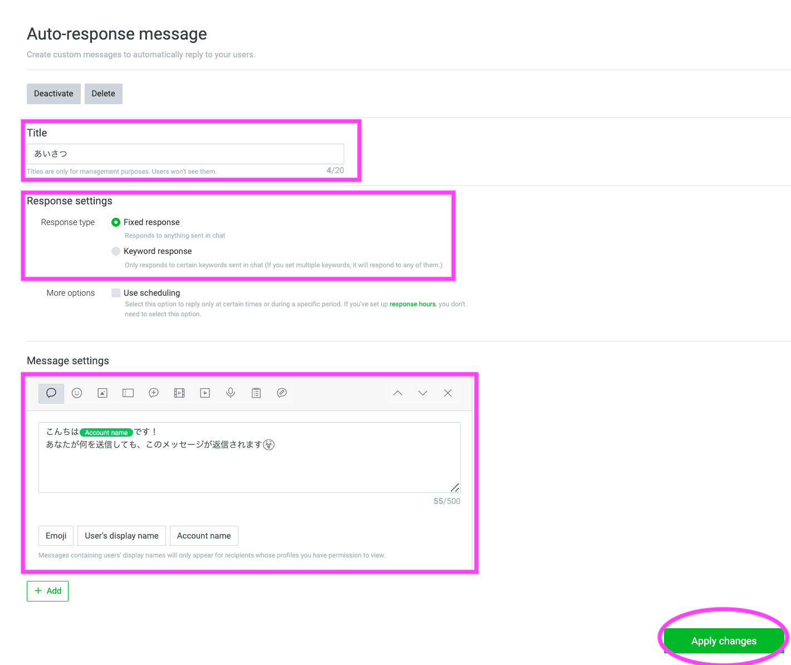
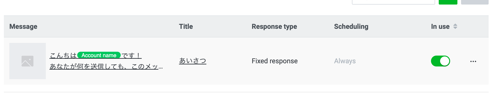
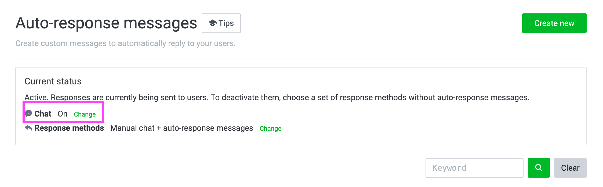
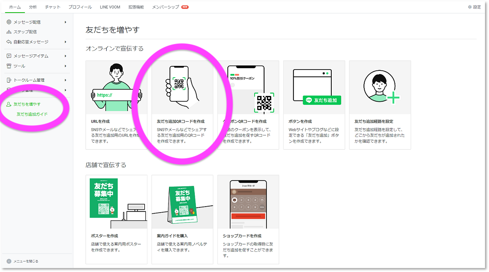

# LINE Official Account ManagerのUIだけで自動返信を作る (無料)

## 自動返信メッセージの設定
1. [LINE Business](https://www.lycbiz.com/jp/signup/)のアカウントを作成

2. 「LINE公式アカウントをはじめる」から指示に従ってアカウントを開設

3. 管理画面に行ったら「自動応答メッセージ」>「応答メッセージ」をクリック

4. 新しい応答メッセージを作成

5.  応答メッセージの設定項目を入力

6. 「利用」スイッチ (トグルボタン) をOn

7. 「チャット」がOnになっていることを確認

## 実際にスマホで使ってみる
1. 友達追加QRコードをつくる

2. スマホのLINEでQRコードを読み取って友達追加する

3. 実際に使ってみる

終わり

#### 参考サイト
[応答メッセージ](https://www.lycbiz.com/jp/manual/OfficialAccountManager/Auto-response-messages/) (Accessed on Mar 17th, 2024) 

[友達追加ガイド](https://www.lycbiz.com/jp/manual/OfficialAccountManager/gain-friends/) (Accessed on Mar 17th, 2024)
